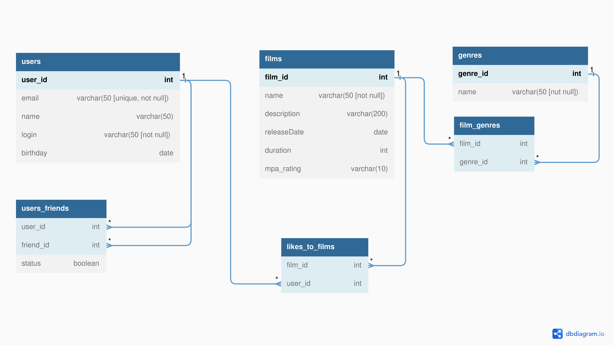

# java-filmorate

### ER-диаграмма и примеры запросов
---


<details>
  <summary><h3>Для пользователей:</h3></summary>
  
* создание пользователя
```SQL
INSERT INTO users (email, login, name, birthday)
VALUES ( ?, ?, ?, ? );
```
* редактирование пользователя
```SQL
UPDATE users
SET email = ?,
    login = ?,
    name = ?,
    birthday = ?
WHERE user_id = ?
```
* получение списка всех пользователей
```SQL
SELECT *
FROM users
```
* получение информации о пользователе по его `id`
```SQL
SELECT *
FROM users
WHERE user_id = id?
```
* добавление в друзья
```SQL
INSERT INTO users_friends (user_id, friend_id, status)
VALUES (?, ?, ?)
```
* удаление из друзей
```SQL
DELETE
FROM users_friends
WHERE user_id = id? AND friend_id = id?
```
* возвращает список пользователей, являющихся друзьями другого пользователя
```SQL
SELECT users.*
FROM users
INNER JOIN users_friends ON users.user_id = users_friends.friend_id
WHERE users_friends.user_id = ?
```
* список друзей, общих с другим пользователем
```SQL
SELECT users.*
FROM users
INNER JOIN users_friends ON users.user_id = users_friends.friend_id
WHERE users_friends.user_id = ?

INTERSECT

SELECT users.*
FROM users
INNER JOIN user_friends ON users.user_id = users_friends.friend_id
WHERE users_friends.user_id = ?
```

</details>
<details>
  <summary><h3>Для фильмов:</h3></summary>

* создание фильма
```SQL
INSERT INTO films (name, description, release_date, duration, mpa_rating)
VALUES (?, ?, ?, ?, ?)
```
* редактирование фильма
```SQL
UPDATE films
SET name = ?,
    description = ?,
    release_date = ?,
    duration = ?,
    mpa_rating = ?
WHERE film_id = ?
```
* получение списка всех фильмов с полной информацией
```SQL
SELECT films.*, COUNT(likes_to_films.user_id) AS likes
FROM films
LEFT JOIN likes_to_films ON films.film_id = likes_to_films.film_id
GROUP BY films.film_id
ORDER BY films.film_id
```
* получение информации о фильме по его `id`
```SQL
SELECT films.*, COUNT(likes_to_films.user_id) AS likes
FROM films
LEFT JOIN likes_to_films ON films.id = likes_to_films.film_id
WHERE films.film_id = ?
GROUP BY films.film_id
```
* пользователь ставит лайк фильму
```SQL
INSERT INTO likes_to_films (film_id, user_id)
VALUES (?, ?)
```
* пользователь удаляет лайк
```SQL
DELETE
FROM likes_to_films
WHERE film_id = ? AND user_id = ?
```
* возвращает список из первых `count` фильмов по количеству лайков
```SQL
SELECT f.name,
       COUNT(lf.user_id) AS likes
FROM films AS f
LEFT JOIN likes_to_films AS lf ON f.film_id=lf.film_id
GROUP BY film_id, f.name
ORDER BY likes DESC
```
* получения списка с названием фильмов и жанра
```SQL
SELECT f.name,
       g.name
FROM films AS f
INNER JOIN films_genres AS fg ON f.film_id=fg.film_id
INNER JOIN genres AS g ON fg.genre_id=g.genre_id;
```
* получения списка имен пользоветелей кто поставил лайк фильму и названия фильма
```SQL
SELECT us.name AS name_user,
       f.name AS name_movie      
FROM films AS f
INNER JOIN likes_to_films AS lf ON f.film_id=lf.film_id
INNER JOIN users AS us ON lf.user_id=us.user_id
ORDER BY us.name
```

</details>
<details>
  <summary><h3>Для жанров:</h3></summary>
  
* получение списка всех жанров
```SQL
SELECT *
FROM genres
```
  
</details>

